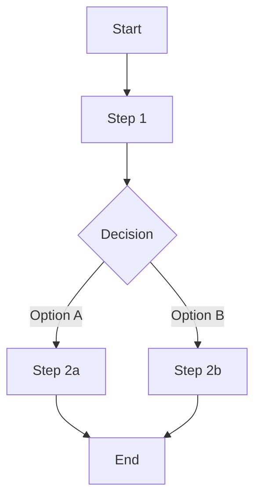

# AI Agent PRD Template

A complete, fill-in-the-blank template for AI Agent product requirements.

---

## Document Information

| Field | Value |
|-------|-------|
| **Agent Name** | [Name] |
| **Author** | [Name] |
| **Status** | Draft / In Review / Approved |
| **Version** | 1.0 |
| **Created** | [Date] |
| **Last Updated** | [Date] |

---

## 1. Executive Summary

### 1.1 Agent Mission

**One Sentence:** [What is this agent's reason for existing?]

**Example:**
> An AI coding assistant that helps developers write, debug, and understand code faster while learning their codebase and preferences over time.

### 1.2 Value Proposition

| For | Who | The Agent | Unlike | Our Agent |
|-----|-----|-----------|--------|-----------|
| [Target user] | [User need] | [Is a solution that] | [Competitor/alternative] | [Key differentiator] |

### 1.3 Success Metrics

| Metric | Definition | Target | Timeline |
|--------|------------|--------|----------|
| [Primary] | [How measured] | [Target] | [When] |
| [Secondary] | [How measured] | [Target] | [When] |

---

## 2. Agent Identity

### 2.1 Persona

| Attribute | Specification |
|-----------|---------------|
| **Name** | [Agent name] |
| **Role** | [What role does it play?] |
| **Personality** | [3-5 personality traits] |
| **Communication Style** | [How it talks] |
| **Expertise Domain** | [What it's an expert in] |

### 2.2 Identity Boundaries

| What It IS | What It Is NOT |
|------------|----------------|
| [Positive definition] | [Negative definition] |
| [Positive definition] | [Negative definition] |
| [Positive definition] | [Negative definition] |

### 2.3 User Relationship Model

**Primary Model:** [ ] Copilot  [ ] Autopilot  [ ] Peer  [ ] Expert  [ ] Executor

**Relationship Dynamics:**
| Situation | Relationship Mode | Agent Behavior |
|-----------|-------------------|----------------|
| [Situation] | [Mode] | [How agent behaves] |

---

## 3. Users & Use Cases

### 3.1 User Personas

#### Primary Persona: [Name]

| Attribute | Description |
|-----------|-------------|
| **Role** | [Job/function] |
| **Goal** | [What they want to achieve] |
| **Pain Points** | [Current frustrations] |
| **Technical Level** | [Novice/Intermediate/Expert] |
| **Trust Level** | [How much autonomy they'll give] |
| **Interaction Preference** | [Chat/Voice/API/Embedded] |

### 3.2 Core Use Cases

#### Use Case 1: [Name]

| Attribute | Specification |
|-----------|---------------|
| **User** | [Which persona] |
| **Goal** | [What user wants to accomplish] |
| **Trigger** | [How user initiates] |
| **Happy Path** | [Ideal flow] |
| **Success Criteria** | [How we know it worked] |
| **Frequency** | [How often this happens] |

[Repeat for each use case]

---

## 4. Capability Architecture

### 4.1 Skills Inventory

| Skill | Purpose | Priority | Dependencies |
|-------|---------|----------|--------------|
| [Skill name] | [What it enables] | P0/P1/P2 | [Tools, RAG, etc.] |

### 4.2 Skills Specifications

#### Skill: [Name]

**Purpose:** [What this skill enables the agent to do]

**Trigger Conditions:**
- User intent: [Patterns that trigger this skill]
- Context: [Conditions that must be true]

**Input:**
| Parameter | Type | Required | Description | Validation |
|-----------|------|----------|-------------|------------|
| [param] | [type] | [Y/N] | [description] | [rules] |

**Process:**
```
1. [Step 1]
2. [Step 2]
3. [Step 3]
```

**Output:**
| Field | Type | Description |
|-------|------|-------------|
| [field] | [type] | [description] |

**Examples:**
| Input | Expected Output | Notes |
|-------|-----------------|-------|
| [example] | [output] | [notes] |

**Boundaries:**
- Cannot: [limitations]
- Edge cases: [special handling]

[Repeat for each skill]

### 4.3 Tools Inventory

| Tool | Purpose | Type | Risk Level |
|------|---------|------|------------|
| [Tool name] | [What it does] | [Read/Write/Execute] | [Low/Medium/High] |

### 4.4 Tools Specifications

#### Tool: [Name]

**Purpose:** [External capability this tool provides]

**Interface Definition:**
```json
{
  "name": "[tool_name]",
  "description": "[Description for LLM]",
  "parameters": {
    "type": "object",
    "properties": {
      "[param]": {
        "type": "[type]",
        "description": "[description]"
      }
    },
    "required": ["[required_params]"]
  }
}
```

**Execution:**
| Attribute | Specification |
|-----------|---------------|
| **Endpoint** | [URL/Function] |
| **Method** | [GET/POST/etc.] |
| **Authentication** | [Method] |
| **Timeout** | [Duration] |
| **Rate Limit** | [Limit] |

**Response Handling:**
| Response Type | Interpretation | Agent Action |
|---------------|----------------|--------------|
| Success (200) | [How to parse] | [What to do] |
| Error (4xx) | [How to interpret] | [Recovery] |
| Error (5xx) | [How to interpret] | [Recovery] |

**Safety:**
| Check | Specification |
|-------|---------------|
| **Permission Required** | [What permission] |
| **Destructive** | [Yes/No] |
| **Confirmation Required** | [When] |
| **Audit Log** | [What to log] |

[Repeat for each tool]

### 4.5 Memory Architecture

#### Working Memory
| Attribute | Specification |
|-----------|---------------|
| **Scope** | Current conversation |
| **Capacity** | [Token limit] |
| **Contains** | [What's included] |
| **Priority Order** | [What to keep when truncating] |

#### Session Memory
| Attribute | Specification |
|-----------|---------------|
| **Scope** | Single session |
| **Duration** | [Session length] |
| **Stored** | [What's saved] |
| **Reset Trigger** | [What clears it] |

#### Long-term Memory
| Attribute | Specification |
|-----------|---------------|
| **Scope** | Cross-session |
| **Stored** | [What's persisted] |
| **Retention** | [How long] |
| **User Control** | [View/Edit/Delete options] |

#### Memory Schema
```json
{
  "user_preferences": {
    "description": "[What preferences are stored]",
    "schema": { }
  },
  "conversation_history": {
    "description": "[What history is stored]",
    "schema": { }
  }
}
```

### 4.6 Knowledge (RAG) Architecture

#### Knowledge Sources
| Source | Content Type | Update Frequency | Size |
|--------|--------------|------------------|------|
| [Source] | [Type] | [Frequency] | [Size] |

#### Retrieval Configuration
| Parameter | Value | Rationale |
|-----------|-------|-----------|
| Embedding Model | [Model] | [Why] |
| Chunk Size | [Tokens] | [Why] |
| Chunk Overlap | [Tokens] | [Why] |
| Top-K | [Number] | [Why] |
| Similarity Threshold | [Score] | [Why] |

#### Knowledge Gaps
| Gap Scenario | Detection | Response |
|--------------|-----------|----------|
| No relevant results | [How detected] | [What agent says] |
| Low confidence | [How detected] | [What agent says] |
| Conflicting information | [How detected] | [What agent says] |

### 4.7 Workflows

#### Workflow: [Name]

**Purpose:** [Complex task this accomplishes]

**Trigger:** [How initiated]

**Flow:**


**Steps:**
| Step | Actor | Action | Success Criteria | Timeout | Failure Handling |
|------|-------|--------|------------------|---------|------------------|
| 1 | [Who] | [What] | [Criteria] | [Time] | [Recovery] |

**Human Checkpoints:**
| Checkpoint | Trigger | Approval Type | Timeout Default |
|------------|---------|---------------|-----------------|
| [Checkpoint] | [When] | [Sync/Async] | [Action if timeout] |

---

## 5. Behavior Specification

### 5.1 Reasoning Strategy

**Primary Strategy:** [ ] ReAct  [ ] Plan-then-Execute  [ ] Tree of Thought  [ ] Custom

**Reasoning Process:**
1. **Perceive:** [How it understands the request]
2. **Think:** [How it reasons about the task]
3. **Plan:** [How it creates an action plan]
4. **Act:** [How it executes]
5. **Reflect:** [How it evaluates results]

### 5.2 Decision Framework

**Priority Order:**
1. [Highest priority principle]
2. [Second priority]
3. [Third priority]

**Decision Rules:**
| Situation | Decision | Rationale |
|-----------|----------|-----------|
| [Situation] | [What to decide] | [Why] |

### 5.3 Conversation Design

**Voice & Tone:**
| Attribute | Specification |
|-----------|---------------|
| Persona | [Professional/Friendly/Expert/etc.] |
| Formality | [Formal/Casual/Adaptive] |
| Verbosity | [Concise/Detailed/User-controlled] |
| Emoji Usage | [Never/Sparingly/Freely] |

**Response Patterns:**
| Scenario | Pattern |
|----------|---------|
| Simple question | [How to respond] |
| Complex task | [How to respond] |
| Clarification needed | [How to respond] |
| Error occurred | [How to respond] |
| Outside scope | [How to respond] |

**Multi-turn Management:**
| Aspect | Handling |
|--------|----------|
| Context retention | [What to remember] |
| Topic switching | [How to handle] |
| Reference resolution | [How to resolve "it", "that"] |
| Conversation reset | [When/how to reset] |

---

## 6. Safety & Guardrails

### 6.1 Capability Boundaries

#### Authorized Actions
| Category | Actions | Conditions |
|----------|---------|------------|
| [Category] | [What's allowed] | [When] |

#### Prohibited Actions
| Action | Reason | Response |
|--------|--------|----------|
| [Prohibited action] | [Why] | [What agent says] |

#### Confirmation Required
| Action | Risk | Confirmation Type |
|--------|------|-------------------|
| [Action] | [Risk level] | [How to confirm] |

### 6.2 Human-in-the-Loop

**Oversight Model:** [ ] Full Autonomy  [ ] Approval Required  [ ] Monitoring  [ ] Suggestion Only

**Escalation Triggers:**
| Trigger | Escalate To | SLA | Default Action |
|---------|-------------|-----|----------------|
| [Trigger] | [Role] | [Time] | [If no response] |

### 6.3 Input Guardrails

| Threat | Detection Method | Response |
|--------|------------------|----------|
| Prompt injection | [Method] | [Response] |
| PII exposure | [Method] | [Response] |
| Harmful request | [Method] | [Response] |
| Off-topic | [Method] | [Response] |

### 6.4 Output Guardrails

| Check | Detection Method | Response |
|-------|------------------|----------|
| Harmful content | [Method] | [Response] |
| PII leakage | [Method] | [Response] |
| Hallucination | [Method] | [Response] |
| Low confidence | [Method] | [Response] |

### 6.5 Error Handling

| Error Type | Detection | User Message | Recovery | Logging |
|------------|-----------|--------------|----------|---------|
| [Type] | [How detected] | [Message] | [Recovery] | [What to log] |

---

## 7. Evaluation Framework

### 7.1 Core Metrics

| Metric | Definition | Target | Measurement | Frequency |
|--------|------------|--------|-------------|-----------|
| Task Success Rate | [Definition] | >X% | [How] | [When] |
| User Satisfaction | [Definition] | >X | [How] | [When] |
| Safety Compliance | [Definition] | 100% | [How] | [When] |
| Latency | [Definition] | <Xs | [How] | [When] |

### 7.2 Evaluation Methods

**Automated Evaluation:**
- [ ] Task completion testing
- [ ] Safety classifier screening
- [ ] Factuality verification
- [ ] Regression testing

**Human Evaluation:**
- Frequency: [How often]
- Sample size: [N]
- Evaluators: [Who]
- Rubric: [Link]

**Red Team Testing:**
- Scope: [What to test]
- Frequency: [How often]
- Team: [Who]

### 7.3 Benchmark Suite

| Benchmark | Purpose | Pass Criteria |
|-----------|---------|---------------|
| [Benchmark] | [What it tests] | [Criteria] |

---

## 8. Operational Model

### 8.1 Cost Model

| Component | Unit Cost | Avg Usage | Per-Interaction |
|-----------|-----------|-----------|-----------------|
| LLM (input) | $[X]/1K | [X] tokens | $[X] |
| LLM (output) | $[X]/1K | [X] tokens | $[X] |
| Embedding | $[X]/1K | [X] tokens | $[X] |
| Tool calls | $[X]/call | [X] calls | $[X] |
| Storage | $[X]/GB | [X] GB | $[X] |
| **Total** | | | **$[X]** |

### 8.2 Cost Controls

| Control | Threshold | Action |
|---------|-----------|--------|
| Per-interaction budget | [Limit] | [Action] |
| Daily spend limit | [Limit] | [Action] |
| Token budget | [Limit] | [Action] |

### 8.3 Scaling Strategy

| Scale | Interactions/Day | Infrastructure | Cost/Month |
|-------|------------------|----------------|------------|
| Launch | [X] | [Setup] | $[X] |
| Growth | [X] | [Changes] | $[X] |
| Scale | [X] | [Changes] | $[X] |

---

## 9. Timeline & Milestones

| Milestone | Date | Deliverables | Success Criteria |
|-----------|------|--------------|------------------|
| Alpha | [Date] | [What] | [Criteria] |
| Beta | [Date] | [What] | [Criteria] |
| Launch | [Date] | [What] | [Criteria] |

---

## 10. Risks & Open Questions

### 10.1 Risks

| Risk | Probability | Impact | Mitigation |
|------|-------------|--------|------------|
| [Risk] | H/M/L | H/M/L | [Strategy] |

### 10.2 Assumptions

| Assumption | Impact if Wrong |
|------------|-----------------|
| [Assumption] | [Impact] |

### 10.3 Open Questions

| Question | Owner | Due | Status |
|----------|-------|-----|--------|
| [Question] | [Name] | [Date] | [Status] |

---

## Appendix

### A. Glossary

| Term | Definition |
|------|------------|
| [Term] | [Definition] |

### B. System Prompt (Draft)

```
[Draft system prompt for the agent]
```

### C. Example Conversations

**Conversation 1: [Scenario Name]**

```
User: [User message]
Agent: [Agent response]
User: [User message]
Agent: [Agent response]
```

### D. Revision History

| Version | Date | Author | Changes |
|---------|------|--------|---------|
| [X.Y] | [Date] | [Name] | [Changes] |
