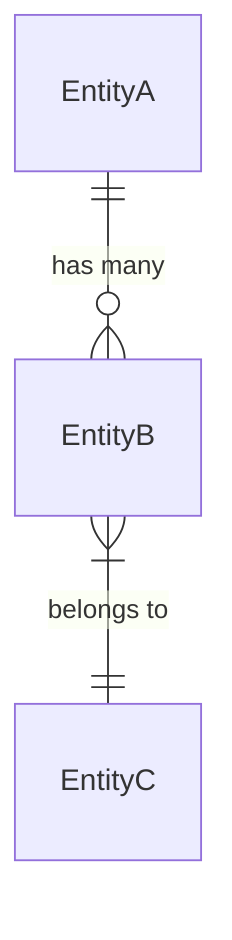
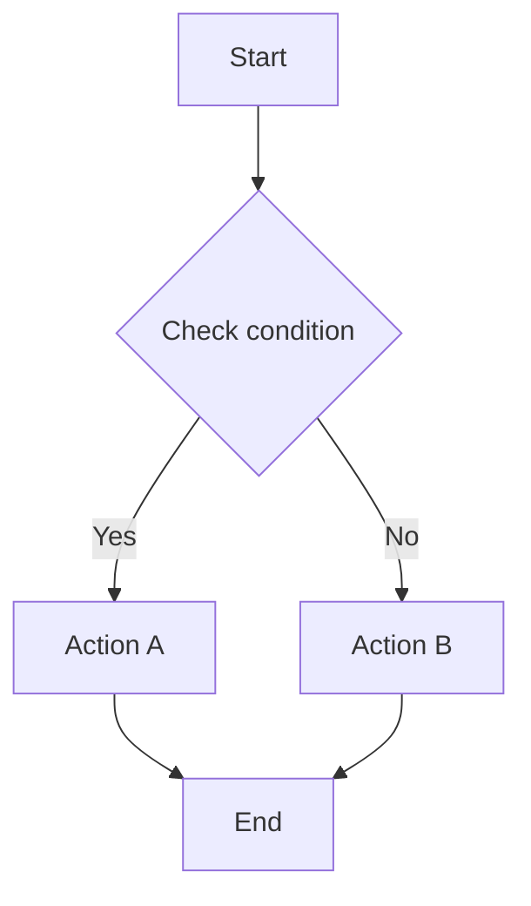
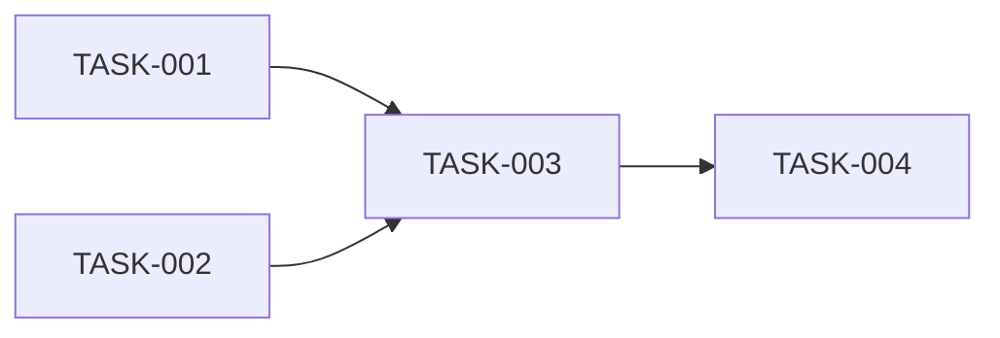

# Feature Specification Template

Use this template to create complete specifications for individual features. Copy and fill in all sections. Delete sections that don't apply, but document why they don't apply.

---

# Feature: [Feature Name]

**Spec ID:** FEAT-[XXX]
**Version:** 1.0
**Status:** [Draft | In Review | Approved]
**Author:** [Name]
**Last Updated:** [Date]

---

## 1. Overview

### 1.1 Summary
[One paragraph describing what this feature does]

### 1.2 Problem Statement
[What problem does this solve? Why does it matter?]

### 1.3 Goals
- [Goal 1]
- [Goal 2]

### 1.4 Non-Goals
- [What this feature explicitly does NOT do]

### 1.5 Success Metrics
| Metric | Current | Target | How Measured |
|--------|---------|--------|--------------|
| [metric] | [baseline] | [goal] | [method] |

---

## 2. Requirements Traceability

### 2.1 Source Requirements
| ID | Requirement | Source |
|----|-------------|--------|
| US-001 | [User story] | PRD Section X |
| BR-001 | [Business rule] | PRD Section Y |

### 2.2 Functional Requirements

| ID | Requirement | Priority | Status |
|----|-------------|----------|--------|
| FR-001 | [Description] | P0 | Approved |

### 2.3 Non-Functional Requirements

| ID | Requirement | Target | Verification |
|----|-------------|--------|--------------|
| NFR-001 | Response time | <200ms P99 | Load test |

---

## 3. User Experience

### 3.1 User Flow

```
[Step-by-step user journey]
1. User does X
2. System shows Y
3. User selects Z
4. System performs A
5. User sees B
```

### 3.2 UI Specifications

#### Screen: [Screen Name]

**Purpose:** [What this screen does]

**Layout:**
```
┌─────────────────────────────────┐
│ [Header]                         │
├─────────────────────────────────┤
│ [Main Content Area]              │
│                                  │
│ [Component A]    [Component B]   │
│                                  │
├─────────────────────────────────┤
│ [Footer/Actions]                 │
└─────────────────────────────────┘
```

**Components:**

| Component | Description | Behavior |
|-----------|-------------|----------|
| [name] | [what it shows] | [interaction] |

**States:**
- Loading: [description]
- Empty: [description]
- Error: [description]
- Success: [description]

### 3.3 Error Messages

| Condition | Message | Recovery Action |
|-----------|---------|-----------------|
| [condition] | "[User-facing message]" | [What user can do] |

---

## 4. Data Model

### 4.1 Entities

#### Entity: [EntityName]

**Purpose:** [What this represents]

**Fields:**

| Field | Type | Null | Default | Constraints | Description |
|-------|------|------|---------|-------------|-------------|
| id | UUID | No | gen | PK | Identifier |
| created_at | timestamp | No | now() | | Creation time |
| updated_at | timestamp | No | now() | | Last update |
| [field] | [type] | [Y/N] | [val] | [constraints] | [desc] |

**Indexes:**

| Name | Columns | Type | Purpose |
|------|---------|------|---------|
| [name] | [cols] | [type] | [why] |

**Constraints:**
- [Constraint 1]
- [Constraint 2]

### 4.2 Relationships



| From | To | Type | Description |
|------|-----|------|-------------|
| EntityA | EntityB | 1:N | [description] |

---

## 5. API Specification

### 5.1 Endpoint: [METHOD] [PATH]

**Purpose:** [What this endpoint does]

**Authentication:** [Required/Optional, method]

**Authorization:** [Roles/permissions required]

#### Request

**Path Parameters:**
| Param | Type | Description |
|-------|------|-------------|
| id | UUID | Resource identifier |

**Query Parameters:**
| Param | Type | Required | Default | Validation | Description |
|-------|------|----------|---------|------------|-------------|
| limit | int | No | 20 | 1-100 | Page size |
| offset | int | No | 0 | ≥0 | Pagination offset |

**Request Body:**
```json
{
  "fieldA": "string (required) - description, max 100 chars",
  "fieldB": "number (optional) - description, range 0-100",
  "nested": {
    "field": "string (required) - description"
  }
}
```

**Validation Rules:**
- fieldA: Required, max length 100, alphanumeric only
- fieldB: Optional, must be positive integer

#### Response

**200 OK:**
```json
{
  "data": {
    "id": "uuid",
    "fieldA": "string",
    "createdAt": "ISO8601"
  }
}
```

**Error Responses:**

| Code | Condition | Body |
|------|-----------|------|
| 400 | Validation failed | `{"error": {"code": "VALIDATION_ERROR", "details": [...]}}` |
| 401 | Not authenticated | `{"error": {"code": "UNAUTHORIZED"}}` |
| 403 | Not authorized | `{"error": {"code": "FORBIDDEN"}}` |
| 404 | Not found | `{"error": {"code": "NOT_FOUND"}}` |
| 409 | Conflict | `{"error": {"code": "CONFLICT", "message": "..."}}` |

#### Behavior

**Happy Path:**
1. Validate request parameters
2. Check authorization
3. [Business logic step]
4. [Business logic step]
5. Return response

**Side Effects:**
- [Database changes]
- [Events emitted]
- [External calls made]

**Idempotency:** [Yes/No, explanation]

**Rate Limiting:** [Limits if any]

---

## 6. Business Logic

### 6.1 Business Rule: [BR-XXX] [Rule Name]

**Description:** [What this rule enforces]

**Trigger:** [When this rule is evaluated]

**Logic:**
```pseudocode
WHEN [trigger condition]
IF [condition A]
  THEN [action A]
ELSE IF [condition B]
  THEN [action B]
ELSE
  THEN [default action]
```

**Decision Table:**

| Input A | Input B | Input C | Output |
|---------|---------|---------|--------|
| X | Y | * | Result 1 |
| X | Z | W | Result 2 |

**Edge Cases:**

| Case | Input | Expected | Rationale |
|------|-------|----------|-----------|
| Null input | null | Error | Required field |
| Empty list | [] | Empty result | No items to process |
| Max value | MAX_INT | [behavior] | [why] |

**Examples:**

1. **Typical case:**
   - Input: [specific values]
   - Expected: [specific output]
   - Explanation: [why]

2. **Edge case:**
   - Input: [specific values]
   - Expected: [specific output]
   - Explanation: [why]

### 6.2 Workflow: [Workflow Name]

**Purpose:** [What this workflow accomplishes]

**Trigger:** [What starts the workflow]



**Steps:**

| Step | Action | Success | Failure |
|------|--------|---------|---------|
| 1 | [action] | → Step 2 | → Error handler |
| 2 | [action] | → Step 3 | → Rollback |

**Compensation (Rollback):**
[How to undo partial execution]

---

## 7. Integrations

### 7.1 Integration: [External System Name]

**Purpose:** [Why we integrate]

**Direction:** [Inbound/Outbound/Bidirectional]

**Protocol:** [REST/GraphQL/gRPC/etc.]

**Authentication:** [API key/OAuth/etc.]

**Endpoints Used:**

| Method | Endpoint | Purpose |
|--------|----------|---------|
| GET | /api/resource | Fetch data |

**Data Mapping:**

| Our Field | Their Field | Transform |
|-----------|-------------|-----------|
| userId | user_id | Direct |
| status | state | Map: active→1, inactive→0 |

**Error Handling:**
| Their Error | Our Response |
|-------------|--------------|
| 429 | Retry with backoff |
| 500 | Return partial data, log error |

**SLA:**
- Timeout: 30s
- Retries: 3 with exponential backoff
- Circuit breaker: Opens after 5 failures

---

## 8. Testing

### 8.1 Unit Tests

| ID | Scenario | Input | Expected | Covers |
|----|----------|-------|----------|--------|
| UT-001 | Happy path | [input] | [output] | BR-001 |
| UT-002 | Null input | null | Error | BR-001 edge |
| UT-003 | Max value | MAX | [output] | BR-001 edge |

### 8.2 Integration Tests

| ID | Scenario | Setup | Action | Verification |
|----|----------|-------|--------|--------------|
| IT-001 | [scenario] | [setup] | [action] | [checks] |

### 8.3 E2E Tests

| ID | User Journey | Steps | Expected |
|----|--------------|-------|----------|
| E2E-001 | [journey] | 1. [step]<br>2. [step] | [result] |

### 8.4 Acceptance Tests

```gherkin
Feature: [Feature Name]

  Scenario: [Scenario Name]
    Given [precondition]
    When [action]
    Then [expected result]
```

---

## 9. Implementation

### 9.1 Tasks

| ID | Task | Estimate | Dependencies | Definition of Done |
|----|------|----------|--------------|-------------------|
| TASK-001 | [task] | 4h | - | Code + tests pass |
| TASK-002 | [task] | 2h | TASK-001 | Reviewed + merged |

### 9.2 Dependencies



### 9.3 Risks

| Risk | Probability | Impact | Mitigation |
|------|-------------|--------|------------|
| [risk] | [H/M/L] | [H/M/L] | [strategy] |

---

## 10. Appendix

### 10.1 Glossary

| Term | Definition |
|------|------------|
| [term] | [definition] |

### 10.2 References

- [Link to PRD]
- [Link to design docs]
- [Link to related specs]

### 10.3 Revision History

| Version | Date | Author | Changes |
|---------|------|--------|---------|
| 1.0 | [date] | [name] | Initial version |

---

## Checklist Before Approval

- [ ] All sections completed (or marked N/A with reason)
- [ ] All requirements have test coverage
- [ ] All edge cases documented
- [ ] No TODO/TBD placeholders
- [ ] Examples provided for complex logic
- [ ] Reviewed by: [reviewer name]
- [ ] Approved by: [approver name]
