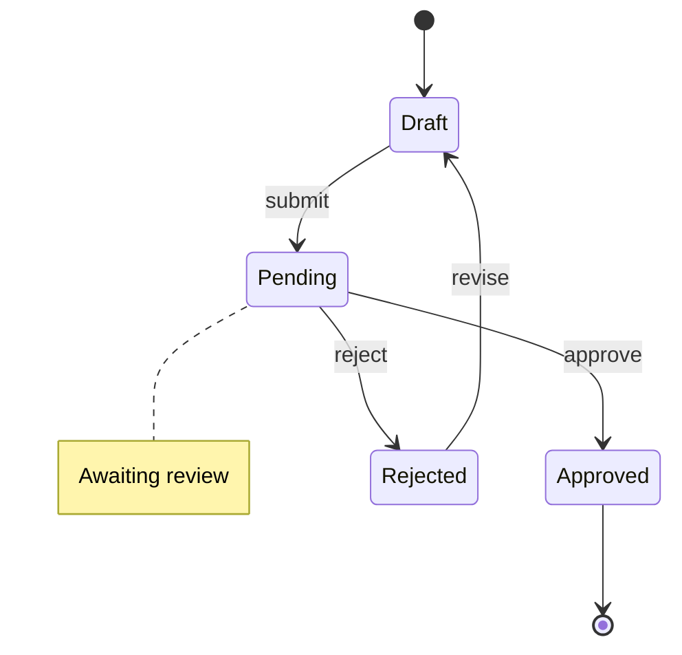
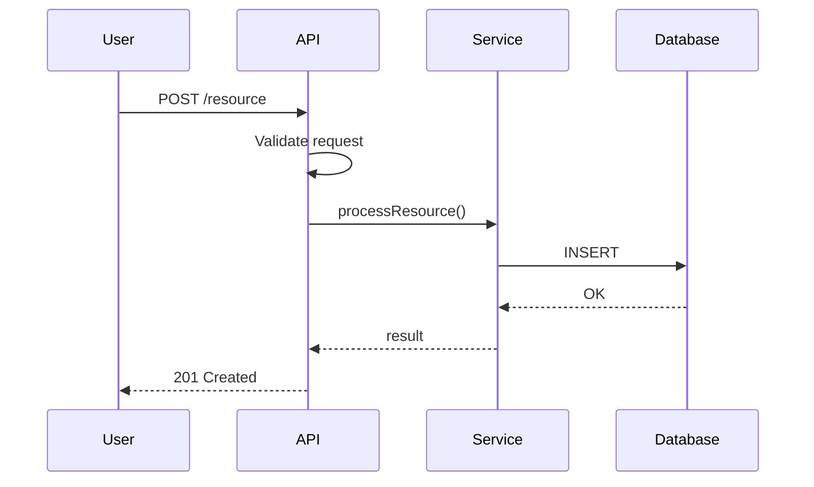
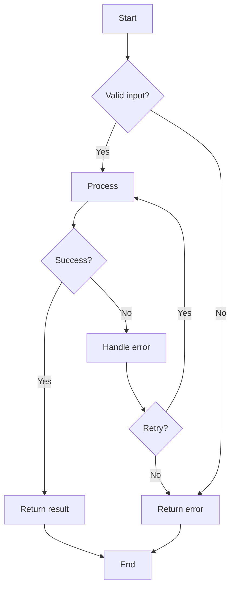

# Detailed Specification Templates

Templates for creating detailed engineering specifications. Use these in Phase 3-5 of the PRD to Engineering Spec workflow.

## Data Model Template

```markdown
## Entity: [EntityName]

### Purpose
[What this entity represents in the domain]

### Source Requirement
[Link to user story or functional requirement]

### Fields

| Field | Type | Nullable | Default | Constraints | Description |
|-------|------|----------|---------|-------------|-------------|
| id | UUID | No | gen | PK | Unique identifier |
| created_at | timestamp | No | now() | | Creation time |
| updated_at | timestamp | No | now() | | Last modification |
| [field] | [type] | [Y/N] | [default] | [constraints] | [purpose] |

### Indexes

| Name | Columns | Type | Purpose |
|------|---------|------|---------|
| [name] | [cols] | [unique/btree/gin] | [why needed] |

### Relationships

| Relationship | Target | Type | FK | Cascade |
|--------------|--------|------|-----|---------|
| [name] | [entity] | [1:1/1:N/N:N] | [field] | [ON DELETE/UPDATE] |

### Validation Rules
- [Rule 1]: [description]
- [Rule 2]: [description]

### Lifecycle
- Created: [when/how created]
- Updated: [when/how updated]
- Deleted: [soft delete? hard delete? cascade?]

### Notes
[Any special considerations]
```

## API Endpoint Template

```markdown
## Endpoint: [METHOD] [PATH]

### Purpose
[What this endpoint does]

### Source Requirement
[Link to user story: US-xxx, FR-xxx]

### Authentication
[Required/Optional/None] - [method: Bearer token, API key, etc.]

### Authorization
[Required permissions/roles]

### Request

#### Path Parameters

| Param | Type | Description |
|-------|------|-------------|
| id | UUID | Resource identifier |

#### Query Parameters

| Param | Type | Required | Default | Validation | Description |
|-------|------|----------|---------|------------|-------------|
| limit | int | No | 20 | 1-100 | Page size |
| offset | int | No | 0 | ≥0 | Pagination offset |
| sort | string | No | created_at | enum[field1,field2] | Sort field |
| order | string | No | desc | enum[asc,desc] | Sort order |

#### Request Body

```json
{
  "fieldA": "string (required) - description, max 100 chars",
  "fieldB": "number (optional) - description, range 0-100",
  "nested": {
    "field": "string (required) - description"
  }
}
```

#### Validation Rules
- fieldA: Required, max length 100, alphanumeric only
- fieldB: Optional, must be positive integer if present
- nested.field: Required when fieldB > 50

### Response

#### Success (200/201)

```json
{
  "data": {
    "id": "uuid",
    "fieldA": "string",
    "createdAt": "ISO8601 timestamp"
  }
}
```

#### Errors

| Code | Condition | Response Body |
|------|-----------|---------------|
| 400 | Validation failed | `{"error": {"code": "VALIDATION_ERROR", "message": "...", "details": [...]}}` |
| 401 | Not authenticated | `{"error": {"code": "UNAUTHORIZED", "message": "..."}}` |
| 403 | Not authorized | `{"error": {"code": "FORBIDDEN", "message": "..."}}` |
| 404 | Resource not found | `{"error": {"code": "NOT_FOUND", "message": "..."}}` |
| 409 | Conflict (duplicate) | `{"error": {"code": "CONFLICT", "message": "..."}}` |
| 429 | Rate limited | `{"error": {"code": "RATE_LIMITED", "message": "...", "retryAfter": 60}}` |

### Business Logic

1. Validate input parameters
2. Check authorization
3. [Business logic step]
4. [Business logic step]
5. Return response

### Side Effects

- Database: [changes made]
- Events: [events emitted]
- External: [external calls made]
- Cache: [cache updates]

### Idempotency

[Is this idempotent? How to achieve idempotency?]

### Rate Limiting

[Limits: X requests per Y time period per Z (user/IP/etc.)]

### Caching

[Cache strategy: TTL, invalidation triggers]
```

## Business Logic Template

```markdown
## Logic: [Name]

### Purpose
[What business problem this solves]

### Source Requirement
[BR-xxx from US-xxx]

### Interface

**Input:**
- param1: type - description - validation
- param2: type - description - validation

**Output:**
- result: type - description

**Errors:**
- ErrorType1: when condition1
- ErrorType2: when condition2

### Algorithm

```pseudocode
function processLogic(param1, param2):
    // Step 1: Validate
    if not valid(param1):
        throw ValidationError
    
    // Step 2: Main logic
    if condition_a:
        result = compute_a(param1)
    else if condition_b:
        result = compute_b(param1, param2)
    else:
        result = default_value
    
    // Step 3: Post-process
    return format(result)
```

### Decision Table

| Condition A | Condition B | Condition C | Result |
|-------------|-------------|-------------|--------|
| True | True | * | Result X |
| True | False | True | Result Y |
| True | False | False | Result Z |
| False | * | * | Result W |

### Edge Cases

| Case | Input | Expected Output | Rationale |
|------|-------|-----------------|-----------|
| Null input | null | Error | Required parameter |
| Empty collection | [] | [] | No items to process |
| Single item | [a] | [a'] | Minimum valid input |
| Max items | [1000 items] | [1000 items'] | Boundary test |
| Duplicate items | [a, a, b] | [a', b'] | Deduplication behavior |

### Examples

**Example 1: Normal case**
- Input: param1 = "value1", param2 = 100
- Expected: result = "processed_value"
- Explanation: Standard processing path

**Example 2: Edge case**
- Input: param1 = "", param2 = 0
- Expected: Error("Invalid input")
- Explanation: Empty string not allowed

### Performance Notes

- Time complexity: O(n)
- Space complexity: O(1)
- Expected latency: <10ms for typical input
```

## Test Specification Templates

### Unit Test Template

```markdown
## Unit Tests: [Module/Function Name]

### Setup
- Dependencies to mock: [list]
- Test data fixtures: [list]

### Tests

| ID | Scenario | Input | Expected | Mocks | Notes |
|----|----------|-------|----------|-------|-------|
| UT-001 | Happy path | valid_input | expected_output | mock_db | Normal case |
| UT-002 | Null input | null | throws NullError | - | Validation |
| UT-003 | Empty string | "" | throws ValidationError | - | Validation |
| UT-004 | Max length | "a" * 1000 | expected | - | Boundary |
| UT-005 | Special chars | "a@b#c" | sanitized | - | Security |
| UT-006 | DB error | valid | throws DBError | mock_db_fail | Error handling |
```

### Integration Test Template

```markdown
## Integration Test: [Service A ↔ Service B]

### Purpose
[What this integration verifies]

### Test Environment
- Database: [test DB setup]
- External services: [mocked/real]
- Auth: [test credentials]

### Tests

| ID | Scenario | Setup | Action | Verification | Cleanup |
|----|----------|-------|--------|--------------|---------|
| IT-001 | Create flow | seed_data | POST /api/x | Check DB, response | Delete created |
| IT-002 | Update flow | create_record | PUT /api/x/1 | Check updated fields | Restore |
| IT-003 | Delete cascade | create_related | DELETE /api/x/1 | Check cascade | - |
| IT-004 | Concurrent access | 2 records | Parallel updates | No conflicts | Restore |
```

### E2E Test Template

```markdown
## E2E Test: [User Journey Name]

### Description
[What complete user journey this tests]

### Preconditions
- System: [system state required]
- User: [user account, permissions]
- Data: [seed data required]

### Steps

| Step | Actor | Action | Expected Result | Screenshot |
|------|-------|--------|-----------------|------------|
| 1 | User | Navigate to /page | Page loads, shows X | login.png |
| 2 | User | Click "Create" | Modal opens | create-modal.png |
| 3 | User | Fill form, submit | Success message | success.png |
| 4 | System | Verify in DB | Record exists | - |

### Variations

| Variation | Differs At | Different Behavior |
|-----------|------------|-------------------|
| Guest user | Step 1 | Redirect to login |
| No permission | Step 2 | Button disabled |
| Validation error | Step 3 | Error message shown |

### Cleanup
[Steps to restore system state]
```

### Acceptance Test Template (Gherkin)

```gherkin
Feature: [Feature Name]
  As a [role]
  I want [capability]
  So that [benefit]

  Background:
    Given [common precondition]
    And [common setup]

  @happy-path
  Scenario: Successful [action]
    Given [specific precondition]
    And [additional setup]
    When [user action]
    And [additional action]
    Then [expected result]
    And [additional verification]

  @validation
  Scenario: Validation error on [field]
    Given [precondition]
    When [invalid action]
    Then [error message shown]
    And [form not submitted]

  @authorization
  Scenario: Unauthorized access
    Given [user without permission]
    When [attempt protected action]
    Then [access denied]

  @edge-case
  Scenario Outline: [Parameterized scenario]
    Given [precondition with <param>]
    When [action with <input>]
    Then [result is <expected>]

    Examples:
      | param | input | expected |
      | A | X | Y |
      | B | Z | W |
```

## Task Breakdown Template

```markdown
## Task: [TASK-XXX] [Task Title]

### Summary
[One sentence description]

### Implements
- Requirements: FR-xxx, US-xxx
- Business Rules: BR-xxx

### Description
[Detailed description of what needs to be done]

### Technical Approach
[How this will be implemented]

### Acceptance Criteria
- [ ] [Criterion 1]
- [ ] [Criterion 2]
- [ ] [Criterion 3]

### Subtasks
- [ ] [Subtask 1] (Xh)
- [ ] [Subtask 2] (Xh)

### Estimate
- Optimistic: Xh
- Realistic: Xh
- Pessimistic: Xh
- **Final estimate:** Xh

### Dependencies
- Blocked by: TASK-xxx (reason)
- Blocks: TASK-xxx

### Risks
- [Risk 1]: [Mitigation]

### Definition of Done
- [ ] Code complete
- [ ] Unit tests written and passing
- [ ] Integration tests passing
- [ ] Code reviewed and approved
- [ ] Documentation updated
- [ ] Deployed to staging
- [ ] QA verified
```

## Workflow Diagram Templates

### State Machine (Mermaid)



### Sequence Diagram (Mermaid)



### Flowchart (Mermaid)



---

## Migration Specification Template

Use when replacing an existing system.

### Data Migration

```markdown
## Data Migration: [Source] → [Target]

### Overview
| Attribute | Value |
|-----------|-------|
| Source system | [name, version] |
| Source format | [DB type, schema version] |
| Target format | [DB type, new schema] |
| Data volume | [rows/GB estimate] |
| Migration window | [allowed downtime] |

### Entity Mapping

| Source Entity | Source Fields | Target Entity | Target Fields | Transformation |
|--------------|-------------|--------------|--------------|----------------|
| old_users | name, email | users | full_name, email | name → full_name |
| old_orders | status (string) | orders | status (enum) | Map: "paid"→COMPLETED |

### Migration Steps
1. [ ] Export from source (method, format)
2. [ ] Transform (script location, validation rules)
3. [ ] Load to target (method, batch size)
4. [ ] Validate (row counts, checksum, spot checks)
5. [ ] Reconcile (comparison queries)

### Rollback Plan
- Trigger: [what conditions trigger rollback]
- Method: [restore from backup / reverse migration]
- Time: [expected rollback duration]
- Data loss: [what data might be lost in rollback]
```

### API Backward Compatibility

```markdown
## API Compatibility: v[old] → v[new]

### Versioning Strategy
| Attribute | Value |
|-----------|-------|
| Method | URL path (/v1/, /v2/) or Header (Accept-Version) |
| Old version support | Until [date] |
| Deprecation notice | [X] months before removal |

### Breaking Changes
| Endpoint | Change | Migration Path |
|----------|--------|---------------|
| GET /api/v1/users | Response shape changed | v2 has new shape; v1 maintained |
| POST /api/v1/orders | Field renamed | Both accepted during transition |

### Coexistence Period
- Duration: [X] weeks/months
- Both versions served simultaneously
- Monitoring: Track v1 vs v2 usage to confirm migration
```

### Cutover Plan

```markdown
## Cutover: [Old System] → [New System]

### Strategy: [Blue-Green / Canary / Big-Bang]

### Pre-Cutover
- [ ] Data migration complete and validated
- [ ] New system passes all acceptance tests
- [ ] Rollback procedure tested
- [ ] Communication sent to stakeholders
- [ ] On-call team briefed

### Cutover Steps
1. [time] Enable maintenance mode / read-only on old system
2. [time] Run final data sync
3. [time] Switch DNS / load balancer to new system
4. [time] Verify health checks
5. [time] Run smoke tests
6. [time] Monitor for [X] minutes
7. [time] Declare cutover complete or trigger rollback

### Rollback Trigger
- Error rate > [X]%
- Critical functionality broken
- Data corruption detected
- Stakeholder decision

### Post-Cutover
- [ ] Monitor for 24 hours
- [ ] Decommission old system after [X] days
- [ ] Archive old system data per retention policy
```
