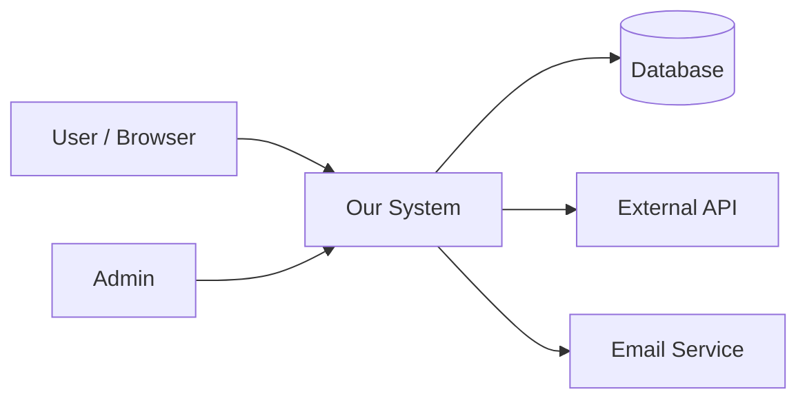

# PRD Template

A complete, fill-in-the-blank template for writing comprehensive PRDs.

---

## Document Information

| Field | Value |
|-------|-------|
| **Title** | [Product/Feature Name] |
| **Author** | [Name] |
| **Status** | Draft / In Review / Approved |
| **Version** | 1.0 |
| **Created** | [Date] |
| **Last Updated** | [Date] |
| **Approvers** | [Names] |

### Revision History

| Version | Date | Author | Changes |
|---------|------|--------|---------|
| 0.1 | [date] | [name] | Initial draft |
| 1.0 | [date] | [name] | Approved for development |

---

## 1. Executive Summary

### 1.1 Problem Statement

[One paragraph describing the problem. Be specific about WHO has the problem, WHAT the problem is, and WHY it matters.]

**Example:**
> Enterprise users managing teams of 50+ members spend an average of 3 hours per week manually tracking project assignments across spreadsheets. This leads to assignment conflicts (estimated 15% of tasks have overlapping assignees) and delayed project starts (average 2-day delay while resolving conflicts).

### 1.2 Solution Overview

[One paragraph describing the proposed solution at a high level.]

**Example:**
> A real-time resource allocation dashboard that automatically detects assignment conflicts, suggests optimal assignees based on availability and skills, and provides at-a-glance visibility into team capacity across all active projects.

### 1.3 Success Metrics

| Metric | Current | Target | Timeline |
|--------|---------|--------|----------|
| [Primary metric] | [baseline] | [target] | [timeframe] |
| [Secondary metric] | [baseline] | [target] | [timeframe] |
| [Secondary metric] | [baseline] | [target] | [timeframe] |

**Example:**
| Metric | Current | Target | Timeline |
|--------|---------|--------|----------|
| Time spent on resource allocation | 3 hrs/week | < 30 min/week | 3 months post-launch |
| Assignment conflicts | 15% | < 2% | 1 month post-launch |
| Project start delays | 2 days avg | < 0.5 days avg | 3 months post-launch |

---

## 2. Background & Context

### 2.1 Business Context

[Why is this important to the business now? What's the strategic driver?]

**Include:**
- Business objectives this supports
- Market trends or competitive pressure
- Internal initiatives this relates to
- Cost of not solving this

### 2.2 User Research Summary

[Summary of user research conducted]

**Include:**
- Research methods used (interviews, surveys, observation)
- Number of users/customers consulted
- Key findings
- Link to full research documentation

### 2.3 Current State Analysis

[How things work today]

**Include:**
- Current user workflow (steps)
- Current tools used
- Pain points (with severity)
- What works well (preserve this)

### 2.4 Competitive Landscape

[How competitors address this problem, if relevant]

| Competitor | Approach | Strengths | Weaknesses |
|------------|----------|-----------|------------|
| [Name] | [Description] | [What they do well] | [Gaps we can address] |

### 2.4 System Context

[Show how this product/feature fits into the broader system landscape.]

**System Context Diagram** (required for any system with external dependencies):



**Include:**
- All actors (user types, external systems, background jobs)
- System boundary (what is inside vs outside our scope)
- Data flows across boundaries (what data crosses each arrow, direction)
- Integration points (APIs, message queues, file transfers, webhooks)

**Core Data Flow Diagram** (required for features involving data transformation):

```
[Data Source] → [Ingestion] → [Processing] → [Storage] → [Presentation]
```

For each flow, note: data format, volume estimate, frequency, and error handling.

---

## 3. Goals & Non-Goals

### 3.1 Goals

[What we are trying to achieve]

1. **[Goal 1]**: [Measurable objective]
2. **[Goal 2]**: [Measurable objective]
3. **[Goal 3]**: [Measurable objective]

### 3.2 Non-Goals

[What we are explicitly NOT trying to achieve in this effort]

1. **[Non-goal 1]**: [Why this is out of scope]
2. **[Non-goal 2]**: [Why this is out of scope]
3. **[Non-goal 3]**: [Why this is out of scope]

**Note:** Non-goals are critical. If it's not listed as a goal or non-goal, it's ambiguous.

### 3.3 Success Criteria

[How we determine if this effort succeeded]

**Launch criteria (must be true to launch):**
- [ ] [Criterion 1]
- [ ] [Criterion 2]
- [ ] [Criterion 3]

**Success criteria (measured post-launch):**
- [ ] [Metric] reaches [target] within [timeframe]
- [ ] [Metric] reaches [target] within [timeframe]

---

## 4. User Stories & Requirements

### 4.1 User Personas

#### Persona: [Name]

| Attribute | Description |
|-----------|-------------|
| **Role** | [Job title/function] |
| **Description** | [Brief profile] |
| **Goals** | [What they want to achieve] |
| **Pain Points** | [What frustrates them] |
| **Technical Level** | [Novice / Intermediate / Expert] |
| **Usage Frequency** | [Daily / Weekly / Monthly] |

[Repeat for each persona]

### 4.2 User Stories

#### US-001: [User Story Title]

**Story:**
As a [role], I want [action], so that [benefit].

**Priority:** P0 / P1 / P2

**Acceptance Criteria:**
- **AC-1:** Given [context], when [action], then [result]
- **AC-2:** Given [context], when [action], then [result]
- **AC-3:** Given [context], when [action], then [result]

**Business Rules:** BR-001, BR-002

**Notes:**
[Any additional context]

[Repeat for each user story]

### 4.3 Functional Requirements

| ID | Requirement | Priority | User Story | Notes |
|----|-------------|----------|------------|-------|
| FR-001 | [Description] | P0 | US-001 | [Notes] |
| FR-002 | [Description] | P0 | US-001, US-002 | [Notes] |

### 4.4 Business Rules

#### BR-001: [Rule Name]

**Description:** [Plain language description]

**Logic:**
```
IF [condition]
THEN [result]
ELSE [alternative result]
```

**Examples:**
- Input: [example input] → Output: [expected output]
- Input: [example input] → Output: [expected output]

**Edge Cases:**
- [Edge case 1]: [handling]
- [Edge case 2]: [handling]

[Repeat for each business rule]

---

## 5. User Experience

### 5.1 User Flows

#### Flow: [Flow Name]

**Trigger:** [How the user starts this flow]

**Steps:**
1. User [action]
2. System [response]
3. User [action]
4. System [response]
5. ...

**Success End State:** [What indicates successful completion]

**Alternative Paths:**
- At step [X], if [condition]: [alternative flow]

**Error Paths:**
- At step [X], if [error]: [error handling]

[Diagram optional but recommended]

### 5.2 Wireframes / Mockups

[Include or link to visual designs]

For each screen, document:
- Screen purpose
- Key elements
- Interactions
- Navigation

### 5.3 Interaction Specifications

#### Element: [Element Name]

| Attribute | Specification |
|-----------|---------------|
| **Trigger** | [Click / Hover / etc.] |
| **Behavior** | [What happens] |
| **Animation** | [Duration, easing] |
| **Feedback** | [Visual / Audio] |

### 5.4 Content & Messaging

#### Message: [Message ID]

| Attribute | Value |
|-----------|-------|
| **Type** | Error / Warning / Info / Success |
| **Trigger** | [When shown] |
| **Title** | [Message title] |
| **Body** | [Message content] |
| **Actions** | [Buttons/links available] |

### 5.5 States

| State | Visual | Content | Actions Available |
|-------|--------|---------|-------------------|
| **Empty** | [Description] | [What to show] | [Available actions] |
| **Loading** | [Description] | [What to show] | [Available actions] |
| **Partial** | [Description] | [What to show] | [Available actions] |
| **Loaded** | [Description] | [What to show] | [Available actions] |
| **Error** | [Description] | [What to show] | [Available actions] |

---

## 6. Data Requirements

### 6.1 Data Model

#### Entity: [Entity Name]

**Purpose:** [What this entity represents]

**Attributes:**

| Attribute | Type | Required | Default | Constraints | Description |
|-----------|------|----------|---------|-------------|-------------|
| id | UUID | Yes | Generated | PK | Unique identifier |
| [name] | [type] | [Y/N] | [default] | [constraints] | [description] |

**Relationships:**
- [Relationship to other entities]

### 6.2 Data Sources

| Data | Source | Sync Method | Frequency |
|------|--------|-------------|-----------|
| [Data type] | [Source system] | [API/Import/etc.] | [Real-time/Daily/etc.] |

### 6.3 Data Lifecycle

| Event | Trigger | Action | Retention |
|-------|---------|--------|-----------|
| Create | [Trigger] | [What happens] | |
| Update | [Trigger] | [What happens] | |
| Delete | [Trigger] | [Soft/Hard delete] | |
| Archive | [Trigger] | [What happens] | [Duration] |

---

## 7. Non-Functional Requirements

### 7.1 Performance

| Metric | Requirement | Measurement |
|--------|-------------|-------------|
| Page load time | < [X]ms at P[Y] | [How measured] |
| API response time | < [X]ms at P[Y] | [How measured] |
| Time to interactive | < [X]s | [How measured] |

### 7.2 Scalability

| Metric | Initial | 1 Year | 3 Years |
|--------|---------|--------|---------|
| Concurrent users | [X] | [X] | [X] |
| Data volume | [X] | [X] | [X] |
| Requests/second | [X] | [X] | [X] |

### 7.3 Availability

| Metric | Requirement |
|--------|-------------|
| Uptime | [X]% (excluding planned maintenance) |
| Planned maintenance window | [Day/time] |
| RTO (Recovery Time Objective) | [Duration] |
| RPO (Recovery Point Objective) | [Duration] |

### 7.4 Security

| Requirement | Specification |
|-------------|---------------|
| Authentication | [Method] |
| Authorization | [Model] |
| Data encryption (transit) | [Standard] |
| Data encryption (rest) | [Standard] |
| Session management | [Timeout, etc.] |
| Audit logging | [What's logged] |

### 7.5 Compliance

| Regulation | Requirements | Implementation |
|------------|--------------|----------------|
| [GDPR/HIPAA/etc.] | [Specific requirements] | [How addressed] |

### 7.6 Accessibility

| Standard | Level | Notes |
|----------|-------|-------|
| WCAG | [2.0/2.1] [A/AA/AAA] | [Specific requirements] |

### 7.7 Browser/Device Support

| Platform | Versions | Notes |
|----------|----------|-------|
| Chrome | [Versions] | |
| Safari | [Versions] | |
| Firefox | [Versions] | |
| iOS | [Versions] | |
| Android | [Versions] | |

---

## 8. Dependencies & Integrations

### 8.1 System Dependencies

| System | Dependency Type | Owner | Risk |
|--------|-----------------|-------|------|
| [System] | [Build/Runtime] | [Team] | [H/M/L] |

### 8.2 External Integrations

#### Integration: [System Name]

| Attribute | Value |
|-----------|-------|
| **Purpose** | [Why we integrate] |
| **Data exchanged** | [What data flows] |
| **Direction** | [Inbound/Outbound/Both] |
| **Method** | [API/Webhook/File/etc.] |
| **Frequency** | [Real-time/Batch] |
| **Owner/Contact** | [Name/Team] |
| **Documentation** | [Link] |
| **SLA** | [Availability, response time] |
| **Failure handling** | [What happens if unavailable] |

### 8.3 Team Dependencies

| Dependency | Team | What's Needed | When Needed |
|------------|------|---------------|-------------|
| [Item] | [Team] | [Description] | [Date] |

---

## 9. Timeline & Milestones

### 9.1 Timeline Overview

| Phase | Start | End | Deliverables |
|-------|-------|-----|--------------|
| Phase 1: [Name] | [Date] | [Date] | [Deliverables] |
| Phase 2: [Name] | [Date] | [Date] | [Deliverables] |

### 9.2 Milestones

| Milestone | Date | Criteria | Owner |
|-----------|------|----------|-------|
| [Milestone] | [Date] | [What must be true] | [Name] |

### 9.3 Release Plan

| Release | Scope | Audience | Criteria |
|---------|-------|----------|----------|
| Alpha | [Features] | [Who] | [Criteria] |
| Beta | [Features] | [Who] | [Criteria] |
| GA | [Features] | [Who] | [Criteria] |

---

## 10. Risks & Open Questions

### 10.1 Risks

| Risk | Probability | Impact | Mitigation | Owner |
|------|-------------|--------|------------|-------|
| [Risk] | H/M/L | H/M/L | [Strategy] | [Name] |

### 10.2 Assumptions

| Assumption | Impact if Wrong | How to Validate |
|------------|-----------------|-----------------|
| [Assumption] | [Impact] | [Validation method] |

### 10.3 Open Questions

| Question | Owner | Due Date | Status |
|----------|-------|----------|--------|
| [Question] | [Name] | [Date] | Open/Resolved |

---

## Appendix

### A. Glossary

| Term | Definition |
|------|------------|
| [Term] | [Definition] |

### B. Reference Documents

| Document | Link | Description |
|----------|------|-------------|
| [Document] | [Link] | [What it contains] |

### C. Change Log

| Date | Section | Change | Author |
|------|---------|--------|--------|
| [Date] | [Section] | [What changed] | [Name] |

---

## PRD Checklist

Before finalizing, verify:

- [ ] Executive summary is clear and compelling
- [ ] Problem is specific and validated
- [ ] Success metrics are measurable
- [ ] All user types are identified
- [ ] Every user story has acceptance criteria
- [ ] All business rules are documented
- [ ] Edge cases are covered
- [ ] Error handling is specified
- [ ] Non-functional requirements are quantified
- [ ] Dependencies are identified
- [ ] Timeline is realistic
- [ ] Risks are documented
- [ ] No ambiguous language remains
- [ ] Stakeholders have reviewed
- [ ] Engineering has reviewed
