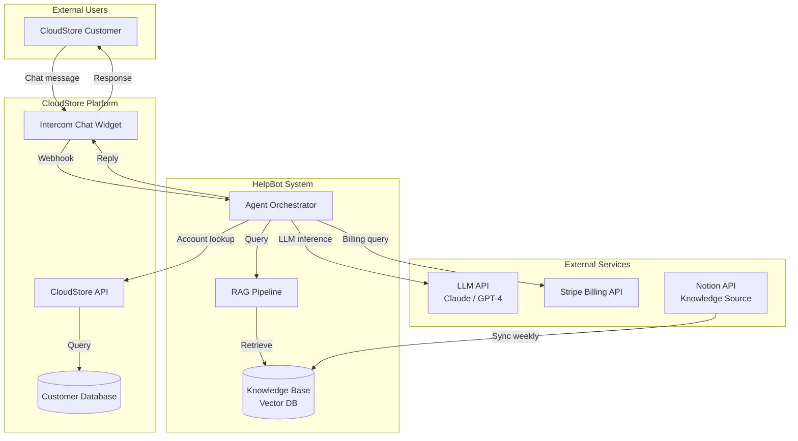
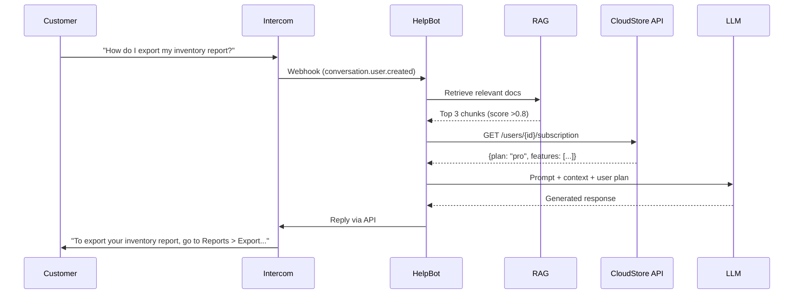

# Worked Example: HelpBot Customer Support Agent PRD

> This example demonstrates the full prd-writing-guide workflow using a realistic product: **HelpBot**, an AI-powered customer support agent for "CloudStore", a B2B SaaS inventory management platform.

---

## Step 1: Discovery Questions (Excerpts)

### Product Vision & Context
- **What problem?** CloudStore's 3-person support team handles 400+ tickets/week, 60% are repetitive (password resets, billing questions, how-to). Average first-response time: 14 hours. CSAT: 3.2/5.
- **Who benefits?** CloudStore customers (SMB warehouse managers), support agents (offload repetitive work), ops team (reduce hiring pressure).
- **Success metric?** Reduce first-response time to <2 minutes for L1 queries; maintain CSAT ≥4.0.

### Integration Deep-Dive (New Section)
- **Cost & Limits:** OpenAI API ~$0.03/conversation avg; budget cap $3,000/month. Anthropic API as fallback.
- **Versioning:** Intercom API v2.10 (stable); Stripe Billing API 2024-04-10.
- **Security:** OAuth 2.0 for Intercom; Stripe restricted API keys (read-only billing). No PII stored in vector DB — only doc chunks. SOC 2 Type II required.
- **Testing:** Intercom sandbox available. Stripe test mode with test clocks.

---

## Step 2: Seven Lenses Applied

| Lens | Key Insight |
|------|-------------|
| **User** | Warehouse managers are non-technical; frustrated by wait times; often on mobile |
| **Business** | Each support hire costs $65K/yr; HelpBot ROI positive if deflects >40% tickets |
| **Technical** | Must integrate Intercom (chat), Stripe (billing), CloudStore API (account data), Notion (knowledge base) |
| **Data** | Conversation logs for training; knowledge base articles (200+ docs); billing records via Stripe |
| **Compliance** | SOC 2 (CloudStore is B2B SaaS); no medical/financial advice; PII handling per GDPR for EU customers |
| **Competitive** | Competitors use basic chatbots with decision trees; AI agent is a differentiator |
| **Timeline** | MVP in 8 weeks; full launch in 12 weeks |

---

## Step 3: System Context Diagram



### Core Data Flow: Customer Query Resolution



---

## Step 4: PRD (Template Applied)

### 4.1 Overview

**Product Name:** HelpBot
**Author:** Jane Chen, PM | **Last Updated:** 2025-05-15
**Status:** In Review | **Version:** 1.0

**Problem Statement:** CloudStore's support team spends 60% of time on repetitive L1 queries (password resets, feature how-tos, billing questions), resulting in 14-hour average first-response times and 3.2/5 CSAT scores. This is unsustainable as the customer base grows 30% QoQ.

**Proposed Solution:** An AI-powered support agent embedded in Intercom that autonomously resolves L1 queries using CloudStore's knowledge base and account data, escalating to humans only when necessary.

**Success Metrics:**

| Metric | Current | Target | Measurement |
|--------|---------|--------|-------------|
| L1 first-response time | 14 hours | <2 minutes | Intercom analytics |
| L1 auto-resolution rate | 0% | >60% | HelpBot dashboard |
| CSAT (HelpBot conversations) | N/A | ≥4.0/5 | Post-conversation survey |
| Support team ticket volume | 400/week | <200/week | Intercom reports |
| Cost per resolved ticket | $12.50 | <$0.50 | Finance tracking |

### 4.2 User Stories

**US-001: Self-Service How-To** (P0)
As a CloudStore user, I want to ask HelpBot how to use a feature, so that I get an instant answer without waiting for a human.

```gherkin
Given I am in the Intercom chat widget
When I ask "How do I export my inventory report?"
Then HelpBot responds within 10 seconds with step-by-step instructions relevant to my subscription plan
And the instructions include a deep link to the relevant CloudStore page
```

**US-002: Billing Inquiry** (P0)
As a CloudStore user, I want to ask HelpBot about my billing, so that I can understand my charges without emailing support.

```gherkin
Given I am authenticated in CloudStore
When I ask "Why was I charged $299 this month?"
Then HelpBot retrieves my billing history from Stripe
And explains the charge breakdown (plan + overages + tax)
And offers to connect me with billing support if I dispute
```

**US-003: Human Escalation** (P0)
As a CloudStore user, when HelpBot can't resolve my issue, I want to be smoothly transferred to a human agent, so that I don't have to repeat my problem.

```gherkin
Given HelpBot has determined it cannot resolve my query
When it escalates to a human
Then the human agent receives the full conversation transcript
And HelpBot's assessment of the issue category
And the customer sees "Connecting you with a specialist..." within 5 seconds
```

### 4.3 Features & Requirements (Abbreviated)

**F-001: Knowledge-Based Q&A** (P0)
- RAG pipeline over CloudStore knowledge base (200+ articles)
- Plan-aware responses (Free vs Pro vs Enterprise features differ)
- Source citation ("Based on [Export Guide]")
- Confidence threshold: only answer if retrieval score >0.75

**F-002: Account & Billing Lookup** (P0)
- Authenticated user context from Intercom
- Read-only access to CloudStore API and Stripe
- Present billing breakdown in natural language
- Never modify account data or process refunds autonomously

**F-003: Smart Escalation** (P0)
- Escalation triggers: low confidence, user frustration detected, 3+ failed resolution attempts, explicit request
- Handoff includes: full transcript, issue category, attempted solutions, customer sentiment

**F-004: Conversation Analytics** (P1)
- Dashboard: resolution rate, avg handle time, escalation reasons, CSAT by category
- Weekly digest email to support lead

### 4.4 Non-Functional Requirements

| Category | Requirement | Target |
|----------|-------------|--------|
| Latency | First response | <5 seconds (P99 <10s) |
| Availability | Uptime | 99.5% (during business hours 99.9%) |
| Scale | Concurrent conversations | 50 simultaneous |
| Cost | Per-conversation LLM cost | <$0.05 average |
| Security | Data access | Read-only; no PII in logs |
| Compliance | SOC 2 Type II | Required for enterprise customers |

### 4.5 Integration Specifications

| System | Protocol | Auth | Rate Limit | Failure Mode |
|--------|----------|------|-----------|-------------|
| Intercom | REST API v2.10 + Webhooks | OAuth 2.0 | 1000 req/min | Queue messages, retry 3x |
| Stripe | REST API 2024-04-10 | Restricted key (read) | 100 req/s | Return "billing info temporarily unavailable" |
| CloudStore API | REST internal | Service token | 500 req/s | Return "account info temporarily unavailable" |
| Notion | REST API 2022-06-28 | Integration token | 3 req/s | Use cached KB; flag staleness |
| LLM (Claude) | Messages API | API key | Per contract | Fallback to GPT-4; if both fail, escalate |

### 4.6 Out of Scope (v1)
- Proactive outreach (HelpBot initiating conversations)
- Multi-language support (English only for MVP)
- Voice/phone channel
- Autonomous actions (refunds, plan changes, account modifications)

---

## Step 5: Handoff to Downstream Skills

This PRD passes Phase 0 validation for `prd-to-engineering-spec`:
- ✅ User stories with acceptance criteria
- ✅ Functional requirements with priorities
- ✅ NFRs with measurable targets
- ✅ Integration specs with auth/limits/failure modes
- ✅ System context diagram
- ✅ Data flow diagram
- ✅ Success metrics with baselines

Because this is an AI Agent product, it also requires `ai-agent-prd` extensions (see worked example in that skill).

---

## Key Takeaways

1. **Seven Lenses forced breadth** — the Compliance lens caught SOC 2 and GDPR requirements that would have been missed; the Data lens identified the knowledge base sync challenge early.

2. **System Context diagrams** made integration complexity visible — 5 external systems became obvious, driving the Integration Deep-Dive questions.

3. **Product Type Emphasis** (AI-Powered from the guidance table) correctly suggested emphasizing: accuracy metrics, fallback behavior, cost per interaction, human escalation paths, and training data strategy.

4. **Measurable success metrics with baselines** ("14 hours → <2 minutes") make the PRD actionable for engineering and evaluable for product.
